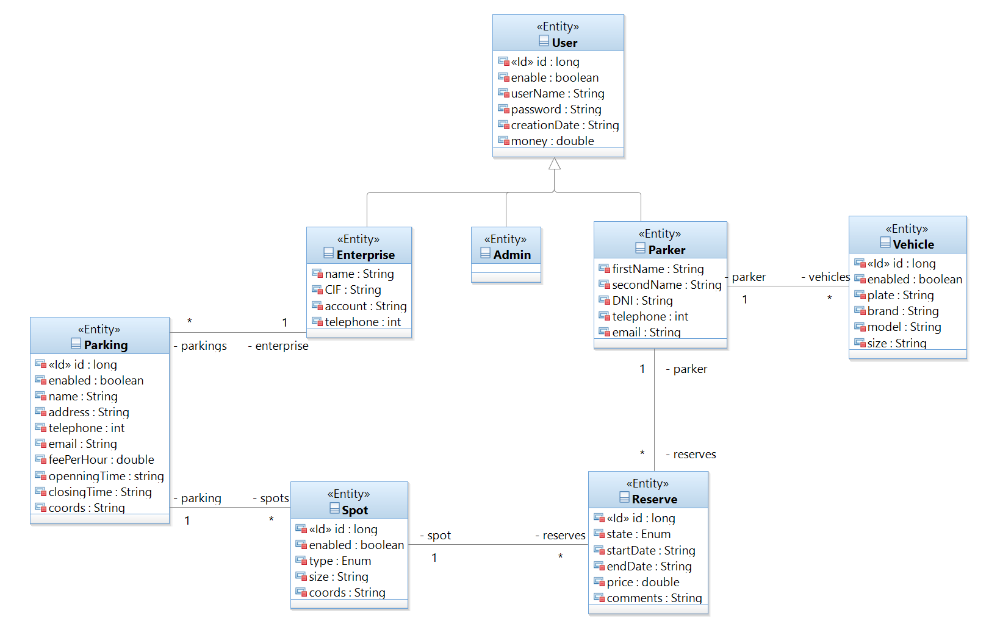

# :oncoming_automobile: ParkIT

Ahorra tiempo y dinero cuando viajas en coche... Olvida las tediosas vueltas y vueltas a la manzana para encontrar un parking... Relájate, con ParkIT tendrás una plaza libre en tu destino esperándote.

ParkIT es una aplicación web (principalmente para dispositivos móviles) que ayuda a los usuarios a encontrar plazas de aparcamiento libres en tiempo real, mostrándolas por zonas en un mapa interactivo y guiándolos hasta ellas.

## 📂 Contenidos
- [Diseño de la Aplicación](#item1)
- [Instalación](#item2)
- [Uso](#item3)
- [Tecnologías Utilizadas](#item4)
- [Despliegue](#item5)
- [Material externo](#item6)
- [Contribución](#item7)
- [Contribuidores](#item8)
- [Licencia](#item9)

<a name="item1"></a>
## 🖥️ Diseño de la Aplicación
La aplicación cuenta con varias vistas que dependiendo de si el usuario es particular o empresa tiene diferentes permisos y funcionalidades (El usuario administrador puede acceder a todas las vistas) para mejorar la navegación y organización. A continuación se detallan las distintas vistas dependiendo del usuario identificado.

### 1. Vistas implementadas
#### 🔹 Inicio
> **Descripción:** Esta es la pantalla principal donde se muestra una introducción a la aplicación, noticias destacadas y accesos rápidos.
> **URL:** [`/`](http://localhost:8080/)

#### 🔹 Iniciar Sesion
> **Descripción:** Formulario para que usuarios, empresas o administradores inicien sesión.
> **URL:** [`/login`](http://localhost:8080/login)

#### 🔹 Ayuda
> **Descripción:** Documentación de uso, preguntas frecuentes y contacto para soporte.
> **URL:** [`/help`](http://localhost:8080/help)

### 1.1. Vistas de Usuario Particular(User)
#### 🔹 Perfil
> **Descripción:** Sección donde el usuario puede ver y editar su información personal, cambiar su contraseña y gestionar sus preferencias.
> **URL:** [`/user/{id}`](http://localhost:8080/user/976)

#### 🔹 Buscar
> **Descripción:** Visualización de plazas de aparcamiento disponibles en tiempo real.
> **URL:** [`/user/map`](http://localhost:8080/user/map)
> > **Vista Accesible desde Buscar:** Formulario de reserva de plaza de aparcamiento
> > **URL:** [`/user/reserve/{parkingId}`](http://localhost:8080/user/reserve/1027)

#### 🔹 Reservas
> **Descripción:** El usuario puede visualizar sus reservas activas.
> **URL:** [`/user/my-reserves`](http://localhost:8080/user/my-reserves)

### 1.2. Vistas de Empresa
#### 🔹 Perfil 
> **Descripción:** Administración de la cuenta de empresa, incluyendo estadísticas de uso.
> **URL:** [`/entrerprise/{id}`](http://localhost:8080/enterprise/977)

#### 🔹 Ver Parkings
> **Descripción:** Visualizar los parkings que la empresa tiene registrados.
> **URL:** [`/enterprise/parkings`](http://localhost:8080/enterprise/parkings)

#### 🔹 Ver Plazas
> **Descripción:** Visualizar las plazas de aparcamiento que la empresa tiene registradas.
> **URL:** [`/enterprise/parking/{parkingId}/plazas`](http://localhost:8080/enterprise/parking/977/plazas)

#### 🔹 Añadir Parking
> **Descripción:** Añadir una zona nueva de aparcamiento en la empresa.
> **URL:** [`/enterprise/add-parking`](http://localhost:8080/enterprise/add-parking)

#### 🔹 Mis solicitudes
> **Descripción:** Añadir una zona nueva de aparcamiento en la empresa.
> **URL:** [`/enterprise/requests`](http://localhost:8080/enterprise/requests)

### 1.3. Vistas de Admin
#### 🔹 Añadir Parking
> **Descripción:** Verificar y añadir una zona nueva de aparcamiento en la empresa que lo solicita.
> **URL:** [`/admin/request-add`](http://localhost:8080/admin/request-add)

#### 🔹 Eliminar Parking
> **Descripción:** Eliminar una zona de aparcamiento en la empresa solicitante.
> **URL:** [`/admin/request-delete`](http://localhost:8080/admin/request-delete)

### 2. Proximamente nuevas Vistas...
#### 🔹 Elimnar Parking Empresa
> **Descripción:** Eliminar una zona nueva de aparcamiento en la empresa.

#### 🔹 Modificar Reserva Usuario
> **Descripción:** Formulario de modificar reserva de plaza de aparcamiento accesible desde vista Reservas [`/user/modify-reserve`](http://localhost:8080/user/modify-reserve)

#### 🔹 Acerca de
> **Descripción:** Dropdown con las vistas de información sobre la aplicacion y su propósito.

#### 🔹 Registrarse
> **Descripción:** Formulario para crear una cuenta de usuario, empresa o administrador.

#### 🔹 Historial de Usuario
> **Descripción:** Historial de estacionamiento con detalles de tiempo y gasto.

#### 🔹 Historial de empresa
> **Descripción:** Estadísticas y datos de ocupación de los parkings de la empresa.

### 2. Falta implementar...
#### 🔹 Especificar dimensiones parking Empresa
> **Descripción:** Falta añadir cuadrícula donde se vean plazas libres y ocupadas especificadas para una zona nueva de aparcamiento en la empresa.

<a name="item2"></a>
## ⚙️ Instalación

1. Clonar el repositorio:
   ```bash
   git clone https://github.com/alexboni97/IW.git
   ```
2. Acceder al directorio:
   ```bash
   cd IW/ParkIT
   ```
3. 📦Instalar dependencias:
   ```bash
   mvn install
   ```
4. ▶️Ejecutar la aplicación:
   ```bash
   mvn spring-boot:run  # Para backend
   ```
5. 🧪Ejecutar prueba reserva:
   ```bash
   mvn test -Dtest=ExternalRunner
   ```
<a name="item3"></a>
## 📌 Uso

1. Iniciar sesión con uno de los usuarios existentes.
> Usuario: "a". Contraseña: "aa" (para Usuario Admin)  
> Usuario: "b" Contraseña:"aa" (para Usuario Parker)  
> Usuario: "e" Contraseña: "aa"   (para Usuario Empresa)  
2. Buscar un aparcamiento disponible en el mapa interactivo.
3. Reservar una plaza del parking para unas fechas concretas.
4. Ver reservas y gestionarlas.
5. Empresas pueden solicitar agregar y eliminar plazas de aparcamiento.
6. El Admin acepta las solicitudes de añadir o eliminar aparcamientos que hace la empresa.

<a name="item4"></a>
## 🛠 Tecnologías Utilizadas

### Frontend

      

### Backend


### Base de Datos


A continuación, se muestra la estructura de la base de datos utilizada en el proyecto:



Utilizamos el archivo StartupConfig.java para generar una base de datos de ejemplo.

### Notificaciones

#### 🔹 **/enterprise/{id}/queue/updates:**
> Canal por donde le llegan a la empresa las notificaciones de confirmación de la nueva reserva desde el usuario o confirmación de la aceptación de la solicitud del nuevo aparcamiento.
#### 🔹 **/topic/admin:** 
> Canal por donde le llegan al Admin las notificaciones de la nueva solicitud del nuevo aparcamiento de una empresa.

### Mapas Interactivos


<a name="item5"></a>
## 🚀 Despliegue
>[!IMPORTANT]
> Debes estar conectado a la VPN de la UCM.
>> **URL:** [`vm023.containers.fdi.ucm.es`](https://vm023.containers.fdi.ucm.es/)

<a name="item6"></a>
## 🔎 Material externo

En esta sección hemos incluído enlaces a material externo sobre el que nos hemos apoyado para realizar algunas partes de la web ParkIT 🚘:

1. Users-card: hemos utilizado una [plantilla de Bootstrap](https://startbootstrap.com/theme/personal). Dicha plantilla se puede utilizar y modificar por presentar una licencia MIT.
2. Navbar: Hemos utilizado la documentación que ofrece [Bootstrap](https://getbootstrap.com/docs/5.3/components/navbar/).
3. Extension en VSCode: para el uso de Bootstrap y elementos preconstruidos, [Bootstrap 5 Quick Snippets](https://github.com/anburocky3/bootstrap5-snippets/tree/master)
4. Mapa interactivo y Buscador: libreria externa para la reenderizacion de mapas interactivos [Leaflet](https://leafletjs.com/)
5. ChatGpt: uso para consulta de funcionalidades de Java, Thymeleaf, Spring-Boot, Html, Css, etc... [ChatGpt](https://chatgpt.com/)

<a name="item7"></a>
## 🤝 Contribución

1. Haz un fork del repositorio.
2. Crea una rama nueva (`git checkout -b feature-nueva`).
3. Realiza tus cambios y haz un commit (`git commit -m 'Agrega nueva funcionalidad'`).
4. Envía un pull request.
<a name="item8"></a>
## 👥 Contribuidores

Agradecemos a todas las personas que han contribuido a este proyecto:
- [Javier Aceituno Monja](https://github.com/jaceituno16)
- [Alex Guillermo Bonilla Taco](https://github.com/alexboni97)
- [Juan Pablo Fernández de la Torre](https://github.com/juanpf04)
- [Paula López Solla](https://github.com/Paula211)
- [Adrián Rodríguez Margallo](https://github.com/adrizz8)
- [Sergio Sánchez Carrasco](https://github.com/WalterDeRacagua) 

<a name="item9"></a>
## 📜 Licencia

Este proyecto está bajo la licencia [Apache License](LICENSE).


